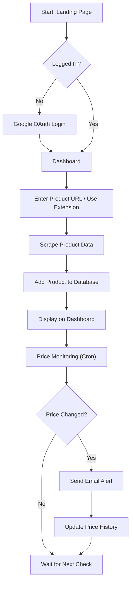
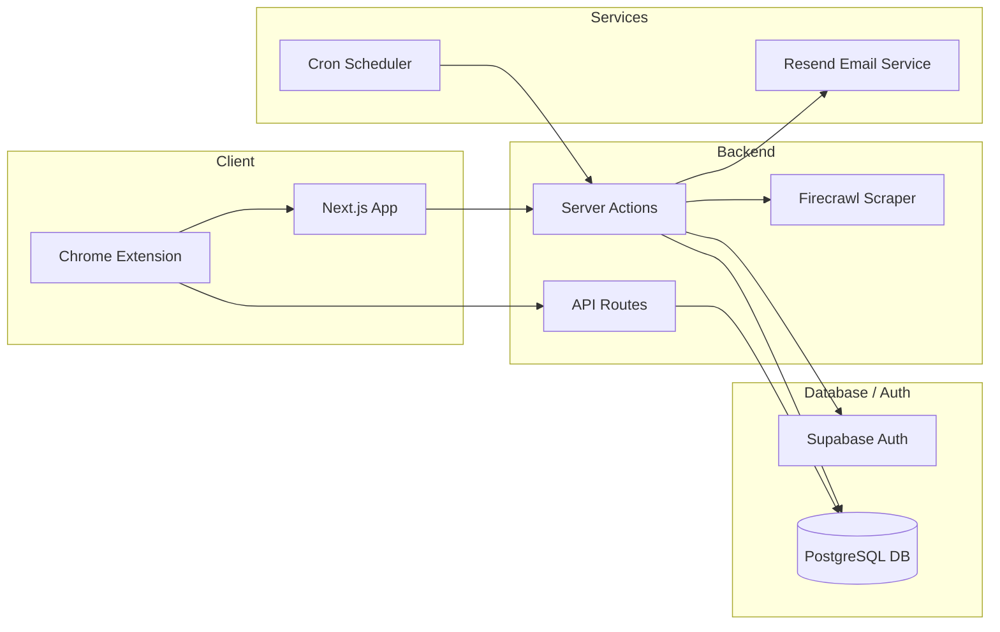

# 🚀 Trackify

**Trackify** is a modern price tracking web application that helps users track product prices in real time, visualize price history, and manage their saved products through a clean, responsive dashboard. It also includes a Chrome Extension for quickly adding products directly from e-commerce websites.

---

## ✨ Features

- 🔐 Google Authentication (Supabase OAuth)
- 🔗 Track products by URL (Amazon and supported stores)
- 🧠 Automatic product scraping (name, price, image, currency)
- 📈 Interactive price history charts
- 🗑️ Secure product deletion
- 🔁 Prevents duplicate tracking per user
- 📱 Fully responsive UI (mobile & desktop)
- ⚡ Fast server actions using Next.js App Router
- ⏰ Scheduled background price checks (cron jobs)
- 📧 Email alerts for price updates
- 🧩 Chrome Extension for one-click product tracking

---

## 🎥 Demo


https://github.com/user-attachments/assets/0b2a8985-7c79-4a75-b295-fdc6cf4a8cd1


---

## 🗺️ User Flow



---

## 🏗️ System Architecture



---

## 🛠️ Tech Stack

- **Frontend:** Next.js (App Router)
- **Backend:** Next.js Server Actions
- **Database & Auth:** Supabase
- **Styling:** Tailwind CSS + shadcn/ui
- **Charts:** Custom Price History Chart
- **Scraping:** Firecrawl-based product scraper
- **Emails:** Resend
- **Scheduling:** Cron jobs (server-side)

---

## 🧩 Database Schema

### `products`
- id
- user_id
- url
- name
- image_url
- current_price
- currency
- created_at
- updated_at

### `price_history`
- id
- product_id
- price
- currency
- checked_at

> Each user can track a product URL only once.

---

## 🔐 Authentication

Google OAuth using Supabase:

```js
await supabase.auth.signInWithOAuth({
  provider: "google",
  options: {
    redirectTo: `${origin}/auth/callback`,
  },
});
```

---

## 🔄 Core Functionality

### ➕ Add Product
- User submits product URL
- URL is normalized
- Product details are scraped automatically
- Product is upserted (unique per user + URL)
- Price history is stored only if the price changes

### 👀 View Products
- Users see only their own tracked products
- Each product card displays:
  - Image
  - Name
  - Current price
  - Tracked since date
  - Interactive price history chart

### 🗑️ Delete Product
- Secure deletion using `user_id` checks
- Associated price history is removed automatically

---

## 🧪 Security & Data Integrity

- Row-level user filtering (`user_id`)
- Composite unique constraint on `(user_id, url)`
- Server-side validation
- Secure delete operations
- Error-safe database queries
- Environment-based secrets for cron & APIs

---

## 🧩 Chrome Extension

Trackify includes a Chrome Extension that allows users to:

- Add the current product directly from supported websites
- Open Trackify with the product URL pre-filled
- Continue securely using existing Google authentication

> Authentication is handled on the web app to ensure session security.

---

## 🧱 Project Structure

```txt
app/
 ├─ actions/
 ├─ components/
 │   ├─ ProductGrid.jsx
 │   ├─ PriceChart.jsx
 │   ├─ DeleteButton.jsx
 ├─ api/
 │   └─ track/
 ├─ auth/
 ├─ page.jsx
 └─ layout.jsx

trackify-extension/
  ├── manifest.json
  ├── popup.html
  ├── popup.js
  ├── background.js
  ├── content.js
  └── icon.png   


utils/
 └─ supabase/

lib/
 └─ firecrawl.js
```

---

## 🚀 Getting Started

### 📥 Clone the repository
```bash
git clone https://github.com/your-username/trackify.git
cd trackify
```

### 📦 Install dependencies
```bash
npm install
```

### 🔑 Environment Variables

Create a `.env.local` file:

```bash
NEXT_PUBLIC_SUPABASE_URL=your_supabase_url
NEXT_PUBLIC_SUPABASE_ANON_KEY=your_supabase_anon_key
NEXT_PUBLIC_SUPABASE_PUBLISHABLE_KEY=your_supabase_publishable_key
NEXT_PUBLIC_SUPABASE_SERVICE_ROLE_KEY=your_supabase_service_role_key
FIRECRAWL_API_KEY=your_firecrawl_api_key
CRON_SECRET=your_cron_secret
RESEND_API_KEY=your_resend_api_key
RESEND_FROM_EMAIL=your_resend_from_email
```

### ▶ Run the app
```bash
npm run dev
```

---

## 🌱 Roadmap

- 🔔 Advanced price-drop alerts
- 📊 Analytics dashboard (trends, averages)
- 🌍 Support for more e-commerce websites
- 🧩 Chrome Extension enhancements
- 💳 Subscription plans (SaaS features)

---

## 🙌 Author

Built by **Divya Saxena** as a full-stack project showcasing real-world problem solving using **Next.js, Supabase, and modern web technologies**.
